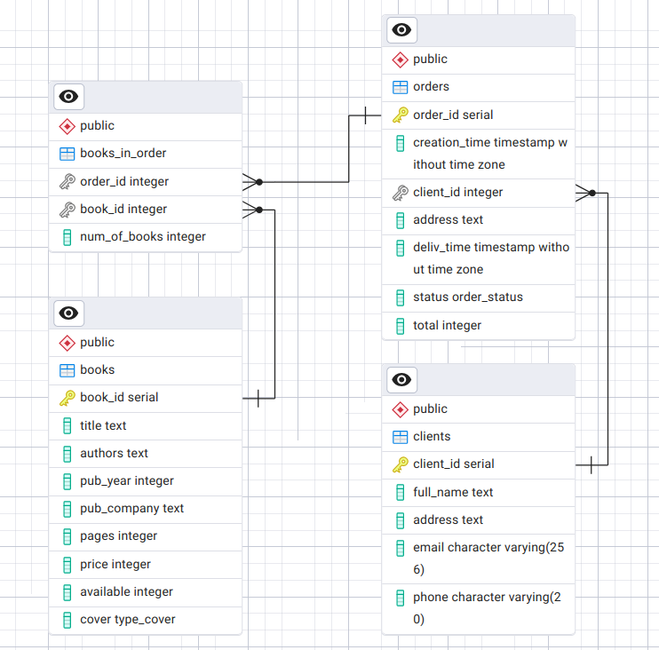
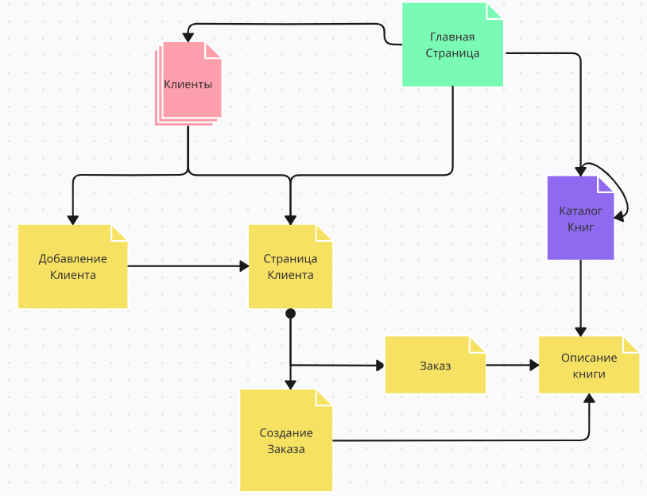

Книжный Интернет-магазин
---
### Цель: Создать систему учета данных о клиентах, книгах и заказах на них

Схема базы данных
-----------------

---
[Cкрипты для создания, заполнения базы данных](https://github.com/SorbaI/web/tree/master/src/main/PostgreSQL)
---
Описание страниц
-----------------------

-----------------------
С любой страницы можно перейти на главную страницу, в каталог книг, или на страницу с клиентами,с помощью ссылок в боковом меню.

### Главная страница
- Ссылка на список всех клиентов.
- Ссылка на страницу для создания клиента.
- Ссылка на каталог книг.

### Страница с каталогом книг
- Список всех книг из БД. 
- Каждый элемент списка содержит название книги, автора, жанр, количество, цену.
- На каждую книгу можно нажать для перехода страницу описания книги.
- Доступна фильтрация: жанр, автор, цена.
- Кнопка для добавления новой книги.

### Страница описания книги
- Содержит всю информацию о книге из БД кроме ID.
- Каждое поле можно изменить.
- Кнопка для удаления информации о книге из БД.
- Кнопка для возврата в каталог.

### Страница со списком всех клиентов
- Список всех клиентов из БД.
- Каждый элемент списка содержит ФИО, телефон.
- Форма для поиска клиента по имени или телефону, отсылает на персональную страницу клиента.
- На каждого человека можно нажать, что приведет на его персональную страницу

### Персональная страница клиента
- Содержит данные клиента из БД кроме ID.
- Возможность редактирования контактной информации, имени.
- Список всех заказов клиента, при нажатии переход на страницу заказа
- Каждый элемент списка заказов содержит дату заказа, статус и стоимость.
- Ссылка на страницу для создания заказа.

### Страница заказа
- Данные заказа с возможностью редактирования.
- Список заказанных книг (С возможностью добавления и удаления)
- Каждый элемент в списке содержит название книги, автора, жанр, количество заказанных книг, стоимость.

Сценарии использования
----------------------

- Добавление клиента
    - Перейти на страницу клиентов
    - Нажать на кнопку "Добавить клиента"
    - Заполнить необходимые поля, подтвердить изменения.
  
- Добавление (Изменение) заказа
    - Перейти на страницу для клиентов
    - Выбрать клиента и перейти на персональную страницу
    - Найти или создать заказ и перейти на страницу заказа
    - Добавить изменить данные в заказе и сохранить изменения.

- Добавление (Изменение) книги
    - Перейти на страницу с каталогом книг.
    - Найти или добавить с помощью специальной кнопки книгу и перейти на страницу книги.
    - Добавить изменить информацию о книге.
	